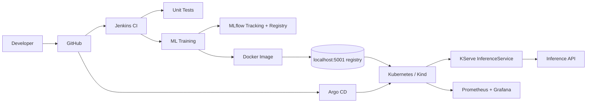
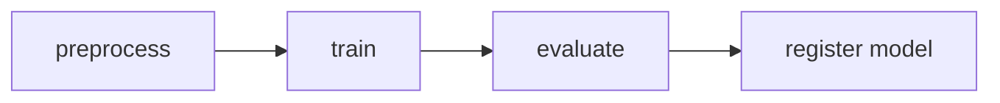

# local-mlops-platform

A complete, **local**, production-style MLOps demonstration built around a
**NYC Taxi fare / trip-time prediction** model. It walks a model through the
full lifecycle entirely on a local Kubernetes (Kind) cluster:

> Data → Training → Experiment Tracking (MLflow) → Model Registry → CI (Jenkins)
> → Container Image → Kubernetes → Serving (KServe) → GitOps (Argo CD) → Monitoring

The project is intentionally small enough to run on a laptop, while keeping the
real architecture so it works as an MLOps/DevOps portfolio and interview piece.

---

## Problem

Predict a NYC taxi trip's **`fare_amount`** (USD) — or, configurably,
**`trip_duration`** (minutes) — from trip features:

| Feature | Meaning |
|---|---|
| `trip_distance` | Trip distance (miles) |
| `passenger_count` | Number of passengers |
| `pickup_hour` | Hour of day (0–23) |
| `pickup_dayofweek` | Day of week (0=Mon) |
| `pu_location_id` | Pickup TLC zone id |
| `do_location_id` | Dropoff TLC zone id |

It is a **regression** problem. Model: `RandomForestRegressor`. Tracked metrics:
`rmse`, `mae`, `r2`, `mape`. A configurable **quality gate** (`MIN_R2`, default
`0.80`) decides whether a model is promoted/registered.

**Data:** by default a small **deterministic synthetic** generator runs fully
offline (great for tests/CI). Set `USE_REAL_DATA=true` and run
`python scripts/download_data.py` to train on a sampled slice of the real
[NYC TLC yellow-taxi trip data](https://www.nyc.gov/site/tlc/about/tlc-trip-record-data.page).

---

## Architecture



### Kubeflow training pipeline



### Model lifecycle


---

## Technology stack

Python 3.12 · scikit-learn · pandas · numpy · MLflow · pytest · Docker ·
Kind (Kubernetes) · KServe · Kubeflow Pipelines · Jenkins · Argo CD ·
Prometheus + Grafana.

---

## Prerequisites

Detected/expected local tooling (see `docs/local-setup.md` for details):

- Python 3.10+ (`python3`), Docker, `kubectl`, Helm, Git
- A local Kubernetes cluster — this repo targets **Kind** (`kind-platform`)
- Pre-installed in-cluster: **KServe** (RawDeployment), **Argo CD**,
  **cert-manager**, **Prometheus/Grafana**
- A local image registry at **`localhost:5001`** (Kind-attached)
- Jenkins at `http://localhost:8080`, Argo CD at `https://127.0.0.1:8443`

> This project does **not** reinstall Jenkins, Argo CD, or Kubernetes.

---

## Quick start (local)

```bash
git clone <repository>
cd local-mlops-platform

make install         # create venv + install deps (see note below)
make test            # run unit tests
make train           # train + evaluate + log to MLflow (if running)
```

> **Windows / OneDrive note:** run everything from **WSL**. Create the virtualenv
> on the native Linux filesystem, not the OneDrive-synced `/mnt/c` path, which is
> slow and can corrupt large installs:
> ```bash
> make install VENV=~/venvs/mlops-demo
> ```
> `make` targets accept `VENV=...`. PowerShell equivalents are in
> `docs/local-setup.md`.

Start MLflow, then re-run training to see tracked runs:

```bash
make mlflow          # http://127.0.0.1:5000  (sqlite backend)
make train
```

---

## Repository layout

| Path | Kind |
|---|---|
| `src/mlops_demo/` | **Application code** (data, train, evaluate, predict, config) |
| `tests/` | Unit / integration tests |
| `scripts/` | Helper scripts (data download, local train, endpoint test) |
| `kubeflow/` | **Pipeline code** (Kubeflow components + pipeline) |
| `docker/` | **Infrastructure** (Dockerfiles) |
| `kubernetes/` | **Infrastructure** (namespace, configmap, secret example) |
| `kserve/` | **Deployment config** (InferenceService) |
| `jenkins/` | **Pipeline config** (Jenkinsfile — CI) |
| `argocd/` | **GitOps config** (Argo CD Application — CD) |
| `docs/` | Architecture, setup, troubleshooting, interview notes |

---

## CI vs CD

- **Jenkins = CI**: checkout → tests → lint → train → quality gate → build image → push.
- **Argo CD = CD/GitOps**: watches Git manifests and syncs KServe/K8s state.

## Why these tools?

- **MLflow** — reproducible experiment tracking + a model registry, instead of
  ad-hoc pickle files.
- **Kubeflow** — portable, containerized, multi-step training pipelines with
  typed artifacts passed between steps.
- **KServe** — standardized, scalable model serving on Kubernetes.
- **Jenkins** — CI (build/test/train), already present.
- **Argo CD** — declarative GitOps CD, already present.

## Why not GitHub Actions (yet)?

This project intentionally demonstrates **Jenkins + Argo CD**. GitHub Actions
could replace the Jenkins CI stages (tests/train/build/push) if desired — see
`docs/architecture.md`.

---

## Documentation

- [docs/architecture.md](docs/architecture.md)
- [docs/local-setup.md](docs/local-setup.md)
- [docs/troubleshooting.md](docs/troubleshooting.md)
- [docs/interview-notes.md](docs/interview-notes.md)

## Security

No credentials are committed. Use `kubernetes/secret.yaml.example` as a template;
real secrets stay local. Containers run as non-root where practical.
