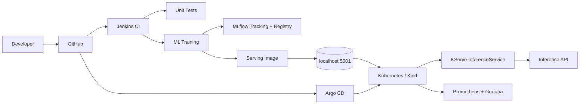
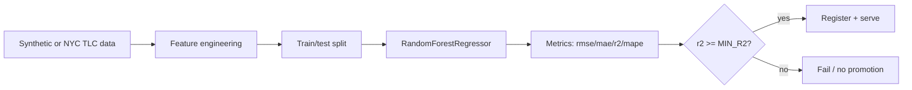
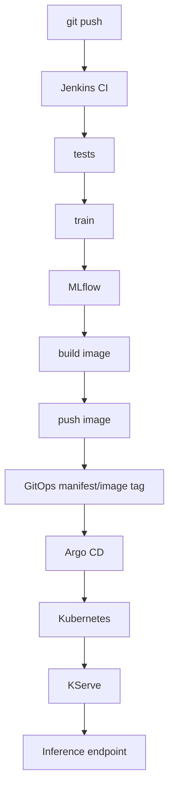

# Architecture

## Overview

`local-mlops-platform` demonstrates a full ML lifecycle for **NYC Taxi fare /
trip-time prediction** on a local Kubernetes (Kind) cluster.

## Component responsibilities

| Component | Responsibility | Classification |
|---|---|---|
| `src/mlops_demo` | Data, training, evaluation, prediction, serving | Application code |
| MLflow | Experiment tracking + model registry | Platform service |
| Kubeflow Pipelines | Orchestrated, containerized training steps | Pipeline code |
| Docker | Reproducible images (train + serve) | Infrastructure |
| Kind + `kubernetes/` | Cluster + namespace/config | Infrastructure |
| KServe (`kserve/`) | Model serving runtime | Deployment config |
| Jenkins (`jenkins/`) | CI: test, train, gate, build, push | Pipeline config |
| Argo CD (`argocd/`, `gitops/`) | GitOps CD | Deployment config |
| Prometheus/Grafana | Metrics + dashboards | Observability |

## Data flow

## Model lifecycle

A run that passes the quality gate registers a new **version** of
`taxi-fare-predictor`. Promotion between stages uses MLflow aliases
(`@staging`, `@production`).

## CI/CD flow

**CI ends** at "push image" (+ recording the tag). **CD begins** when Argo CD
syncs the Git manifests.

## Why each technology?

- **Why MLflow?** Reproducible tracking of params/metrics/artifacts and a
  registry of versioned models — far better than ad-hoc pickle files.
- **Why Kubeflow?** Portable, containerized, multi-step pipelines with typed
  artifacts; scales training beyond a single script.
- **Why KServe?** Standardized, scalable model serving on Kubernetes with a
  consistent dataplane (`/v1/models/{name}:predict`).
- **Why Jenkins?** Mature CI already present; runs tests/train/build/push.
- **Why Argo CD?** Declarative GitOps CD — the cluster continuously converges to
  the Git-defined desired state (prune + self-heal).
- **Why Kubernetes?** Uniform, declarative substrate for training and serving
  workloads with scaling, health management, and rollout control.

## GitHub Actions alternative

GitHub Actions could replace the Jenkins CI stages (tests → train → build →
push). Argo CD would remain for CD. This project uses Jenkins + Argo CD
deliberately to demonstrate that toolchain.
