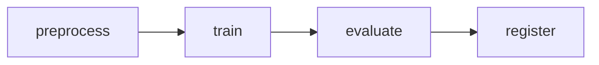

# Kubeflow Pipelines

A four-step training pipeline built with the **Kubeflow Pipelines v2 SDK (KFP)**:



Each step is a container that exchanges **typed artifacts** (`Dataset`, `Model`,
`Metrics`) — no hidden local files.

## Concepts

| Concept | Here |
|---|---|
| component | `components/preprocess.py`, `train.py`, `evaluate.py`, plus `register` |
| pipeline | `pipeline.py` (`nyc-taxi-training-pipeline`) |
| artifact | `Dataset` (CSV), `Model` (joblib), `Metrics` |
| parameter | `n_samples`, `n_estimators`, `min_r2`, `target` |
| run / experiment | created when you submit the compiled pipeline |

## Compile

```bash
pip install "kfp>=2.7,<3"
python kubeflow/pipeline.py     # -> kubeflow/nyc_taxi_pipeline.yaml
# or:
make kfp-compile
```

Compilation produces a portable IR YAML that any KFP-compatible backend can run.

## Run

Submit `nyc_taxi_pipeline.yaml` via the Kubeflow Pipelines UI, or with the SDK:

```python
from kfp.client import Client
Client(host="http://localhost:8080").create_run_from_pipeline_package(
    "kubeflow/nyc_taxi_pipeline.yaml",
    arguments={"n_samples": 20000, "min_r2": 0.80},
)
```

> If a full Kubeflow Pipelines backend is not installed locally, the pipeline
> still **compiles** (validated in CI). Installing the KFP backend is optional
> for this demo; the same lifecycle also runs via `make train` + MLflow.

## MLflow vs Kubeflow

- **MLflow** tracks experiments and versions models (the *what* and *results*).
- **Kubeflow Pipelines** orchestrates the *steps* that produce those models,
  with reproducible, containerized, artifact-passing stages.
